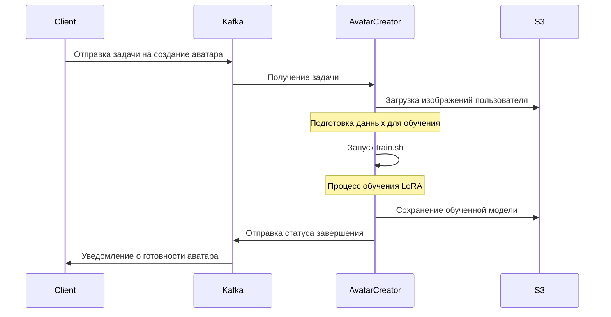

# Selfix Avatar Creator

## Обзор

Selfix Avatar Creator - это система для создания персонализированных ИИ-аватаров, использующая технологии глубокого обучения. Система обрабатывает задачи из очереди Kafka, выполняет тренировку моделей LoRA на основе пользовательских изображений и сохраняет результаты в S3-совместимое хранилище.

## Архитектура

### Компоненты системы

1. **Обработчик задач (.NET)** - основной сервис, который:
   - Получает задания из Kafka
   - Подготавливает данные для обучения
   - Запускает процессы обучения моделей
   - Отправляет результаты обратно
2. **ML-компоненты (Python)** - набор инструментов для обучения моделей:

   - `sd-scripts` - библиотека для работы с моделями Stable Diffusion
   - Скрипты тренировки (включая `train.sh`)
   - Конфигурации обучения

3. **Модели и данные**:
   - Базовые модели (unet, clip, vae)
   - Пользовательские изображения
   - Обученные LoRA-модели

### Технологический стек

- **Языки программирования**: C# (.NET), Python
- **ML-фреймворки**: PyTorch, Accelerate
- **Инфраструктура**: Docker, NVIDIA CUDA
- **Интеграции**: Kafka, S3-совместимое хранилище

## Процесс обработки задач



## Тренировка моделей

### Процесс тренировки

1. Загрузка пользовательских изображений
2. Подготовка датасета (создание `dataset.toml`), вом числе создание captions файлов используя модель Florence 2
3. Запуск скрипта `train.sh` с указанием рабочей директории
4. Обучение LoRA-модели с использованием GPU
5. Сохранение результатов

### Параметры обучения

Основные параметры, используемые при обучении LoRA-моделей:

- **Базовые модели**:

  - UNet: flux1-dev.sft (возможно fp8 версия)
  - CLIP: clip_l.safetensors
  - T5XXL: t5xxl_fp16.safetensors (возможно fp8 версия)
  - VAE: ae.sft

- **Гиперпараметры**:
  - Размерность LoRA: 4
  - Количество эпох: 10
  - Скорость обучения: 8e-4
  - Тип оптимизатора: adamw8bit
  - Функция потерь: L2

## Развёртывание и запуск

### Требования к системе

- NVIDIA GPU с поддержкой CUDA
- Docker и Docker Compose
- Доступ к сервисам Kafka и S3

### Docker конфигурация

Система развертывается в Docker-контейнере с использованием образа на базе CUDA:

1. **Образ**: nvidia/cuda:12.4.1-base-ubuntu22.04
2. **Основные компоненты**:

   - .NET 9.0 Runtime и SDK
   - Python 3 с PyTorch (CUDA-совместимый)
   - Клонированный репозиторий sd-scripts

3. **Переменные окружения для интеграции**:

   - Kafka:

     - `KAFKA_BOOTSTRAP_SERVER`: Адрес Kafka (например, `kafka1:9092`)
     - `KAFKA_SECURITY_PROTOCOL`: Протокол безопасности (например, `SASL_SSL`)
     - `KAFKA_SASL_MECHANISM`: Механизм аутентификации (например, `PLAIN`)
     - `KAFKA_SASL_USERNAME`: Имя пользователя Kafka
     - `KAFKA_SASL_PASSWORD`: Пароль для Kafka
     - `KAFKA_GROUP_ID`: ID группы потребителей (например, `avatar-creator-group`)
     - `KAFKA_TOPIC_INPUT`: Имя входного топика для заданий (например, `avatar-creation-jobs`)
     - `KAFKA_TOPIC_OUTPUT`: Имя выходного топика для результатов (например, `avatar-creation-results`)

   - S3:
     - `S3_ENDPOINT`: Адрес S3-совместимого хранилища
     - `S3_ACCESS_KEY`: Ключ доступа к S3
     - `S3_SECRET_KEY`: Секретный ключ для S3
     - `S3_REGION`: Регион S3 (например, `us-east-1`)
     - `S3_BUCKET`: Имя бакета для хранения данных
     - `S3_USE_SSL`: Использование SSL (true/false)

### Запуск через Docker Compose

```bash
docker compose up -d
```

### Структура томов

- **/app/ml/models**: Директория для хранения базовых моделей
  - /app/ml/models/unet
  - /app/ml/models/clip
  - /app/ml/models/vae
- **/app/ml/outputs**: Директория для хранения результатов обучения

## Интеграция

### Топики Kafka

Сервис использует следующие топики Kafka, настраиваемые через переменные окружения:

1. **Входные топики**:

   - `${KAFKA_TOPIC_INPUT}`: Входящие задачи на создание аватаров

2. **Выходные топики**:
   - `${KAFKA_TOPIC_OUTPUT}`: Результаты создания аватаров

### Формат сообщений

**Входящее сообщение для создания аватара**:

```json
{
  "taskId": "uuid-task-identifier",
  "userId": "user-identifier",
  "images": [
    "users/user-id/images/image1.jpg",
    "users/user-id/images/image2.jpg",
    "users/user-id/images/image3.jpg"
  ],
  "configurationParams": {
    "epochs": 10,
    "learningRate": 8e-4,
    "networkDim": 4
  },
  "priority": 1
}
```

**Исходящее сообщение с результатом**:

```json
{
  "taskId": "uuid-task-identifier",
  "userId": "user-identifier",
  "status": "completed",
  "modelPath": "users/user-id/models/avatar-model.safetensors",
  "metrics": {
    "trainingTime": 1200,
    "finalLoss": 0.0023
  }
}
```

### Вызов из .NET приложения

Пример кода для запуска процесса обучения из C#:

```csharp
var process = new Process
{
    StartInfo = new ProcessStartInfo
    {
        FileName = "/bin/bash",
        Arguments = $"/app/ml/Scripts/train.sh /app/ml",
        RedirectStandardOutput = true,
        UseShellExecute = false,
        CreateNoWindow = true,
    }
};
process.Start();
```

### Параметры запуска train.sh

```bash
./train.sh [базовая_директория]
```

Где `базовая_директория` - путь к директории с моделями и выходными данными (по умолчанию: `/workspace`).

## Исходные файлы

- **Dockerfile**: Определяет окружение для .NET и ML-компонентов
- **compose.yml**: Конфигурация Docker Compose с настройками GPU и томов
- **Scripts/train.sh**: Скрипт запуска обучения LoRA-модели
- **Selfix.Jobs.AvatarCreator.csproj**: Проект .NET обработчика задач

## Мониторинг и логирование

- Логи контейнера доступны через `docker logs avatar-creator`
- Метрики процесса обучения сохраняются в директории выходных данных
- Параметр `--log-level` определяет детализацию логов (info, debug, warning, error)

### Пример настройки через docker-compose

```yaml
avatar-creator:
  build:
    context: .
    dockerfile: Dockerfile
  image: avatar-creator
  container_name: avatar-creator
  environment:
    - KAFKA_BOOTSTRAP_SERVER=kafka1:9092
    - KAFKA_SECURITY_PROTOCOL=SASL_SSL
    - KAFKA_SASL_MECHANISM=PLAIN
    - KAFKA_SASL_USERNAME=kafka-username
    - KAFKA_SASL_PASSWORD=kafka-password
    - KAFKA_GROUP_ID=avatar-creator-group
    - KAFKA_TOPIC_INPUT=avatar-creation-jobs
    - KAFKA_TOPIC_OUTPUT=avatar-creation-results
    - S3_ENDPOINT=minio:9000
    - S3_ACCESS_KEY=minio-access-key
    - S3_SECRET_KEY=minio-secret-key
    - S3_REGION=us-east-1
    - S3_BUCKET=avatar-data
    - S3_USE_SSL=false
  volumes:
    - /home/stan/selfix/models:/app/ml/models:ro
  deploy:
    resources:
      reservations:
        devices:
          - driver: nvidia
            count: all
            capabilities: [gpu]
  restart: unless-stopped
```

---

_Документация составлена для внутреннего использования команды Selfix_
